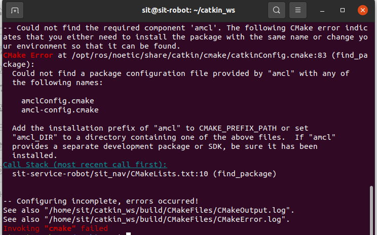
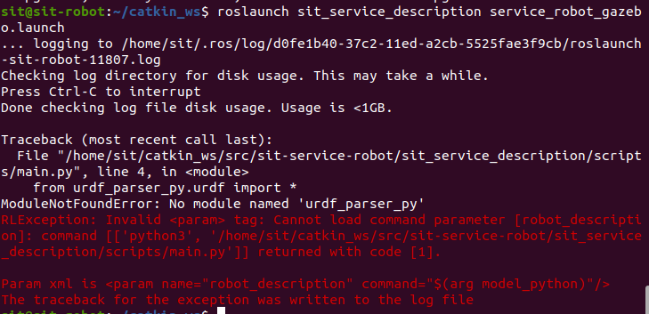
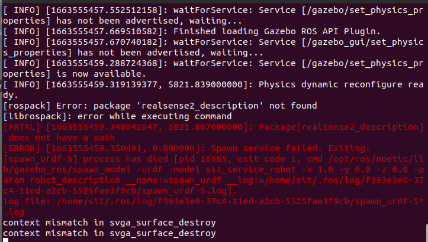
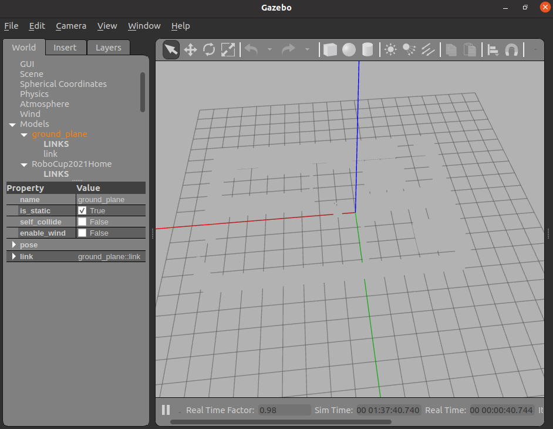
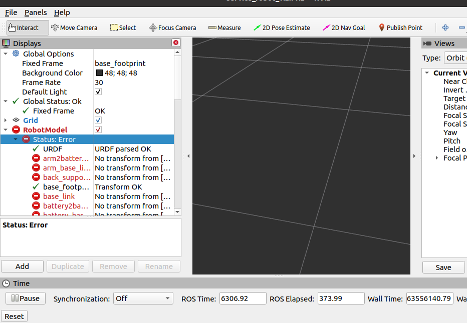
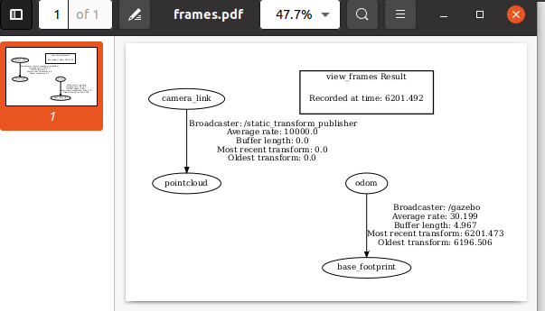
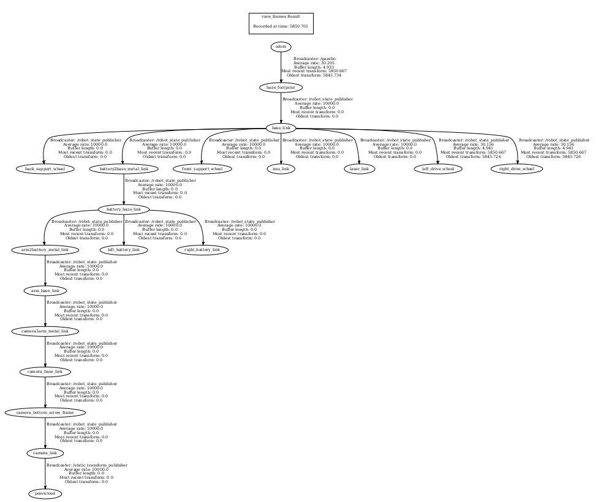
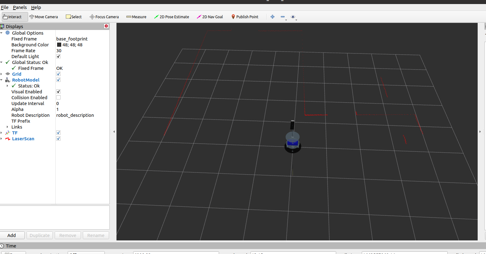
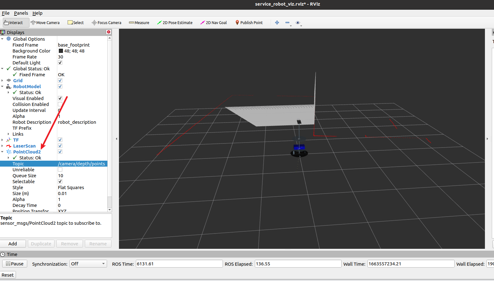

# 克隆代码

```shell
git clone https://github.com/SIT-Robot/sit-service-robot.git
git clone https://github.com/SIT-Robot/sit-basketball-robot.git
```

# 编译代码

```shell
catkin_make
```

有可能报错如下，



```shell
sudo apt install ros-noetic-navigation
sudo apt install ros-noetic-gmapping
```

# 启动环境

此时启动机器人仿真环境

可能报错如下，我们需要安装urdf的python插件



```shell
sudo apt install ros-noetic-urdfdom-py
```

再次启动仍可能报错如下，我们需要安装realsense2_description包



```shell
sudo apt install ros-noetic-realsense2-description
```

此时已经成功启动机器人仿真环境，但是可能效果如下，显示异常



使用`roslaunch sit_service_description service_robot_viz.launch`打开rviz查看



发现似乎是tf全部失效。

根据以下文章，查看tf树

[5.1.5 坐标系关系查看 · Autolabor-ROS机器人入门课程《ROS理论与实践》零基础教程](http://www.autolabor.com.cn/book/ROSTutorials/di-5-zhang-ji-qi-ren-dao-hang/51-tfzuo-biao-bian-huan/515-zuo-biao-xi-guan-xi-cha-kan.html)




发现目前仅存在上述tf变换。

重开几次，有一定几率建立完整tf



此时继续启动service_robot_viz.launch，可发现机器人已经成功加载，并且显示出模型，雷达线等。



如果电脑性能较好，还可尝试订阅深度相机发布的点云消息，



# 启动键盘控制器

启动键盘控制器

`rosrun sit_teleop teleop.py`

即可使用键盘控制rviz中的机器人了。

> PS: Gazebo中的场景贴图还是无法正常加载，我也不清楚为何，或许是虚拟机的问题。但是rviz中已经实现了机器人的可视化，并显示周围的环境感知。


# SLAM建图

`roslaunch sit_nav gmapping_slam.launch` 即可启动slam建图，使用键盘控制机器人运动，即可逐步建立环境地图。


