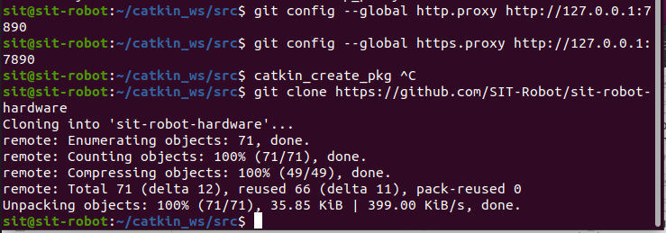
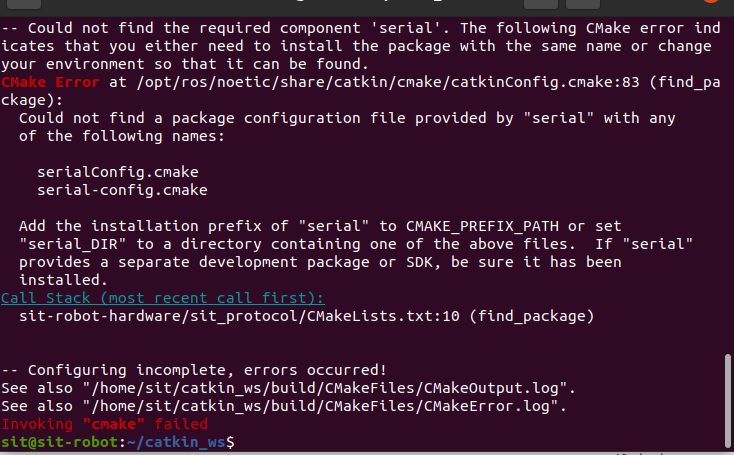
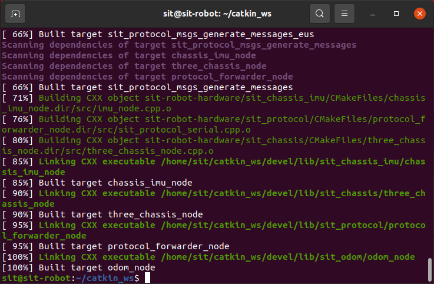
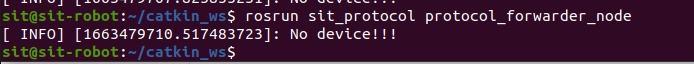
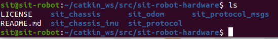

# ROS工作目录

如果还没有创建自己的ROS工作目录，请先创建一个自己的ROS工作目录。

请先完成如下章节实验

[1.3 ROS快速体验 · Autolabor-ROS机器人入门课程《ROS理论与实践》零基础教程](http://www.autolabor.com.cn/book/ROSTutorials/chapter1/13-rosji-cheng-kai-fa-huan-jing-da-jian.html)


# 下载代码

进入工作目录的src目录下，

从github上clone仓库（这一步之前请先安装git, `sudo apt install git`）

```shell
git clone https://github.com/SIT-Robot/sit-robot-hardware.git
```

注意从github上clone代码可能需要配置代理服务器。

如果虚拟机中，已安装clash环境，则可直接使用以下命令配置git代理

```bash
git config --global http.proxy http://127.0.0.1:7890
git config --global https.proxy http://127.0.0.1:7890
```

然后代码便下载成功



然后返回catkin_ws即可运行`catkin_make`编译硬件层代码。

如果我们没有安装ros的串口包，可能会报错如下



此时只需运行`sudo apt install ros-noetic-serial`即可完成ros串口驱动包的安装。

再次执行编译，即可完成硬件层代码的编译



此时连接下位机串口，运行命令

`rosrun sit_protocol protocol_forwarder_node`即可运行上下位机之间通信的节点。



通过ls命令可以查看机器人硬件层的功能包如下，



其中，

1. `sit_protocol`便为上下位机通信包，主要负责数据包解析，发送，crc校验等工作

2. `sit_protocol_msgs`为上下位机通信的消息文件，主要提供给其他硬件节点用于收发消息

3. `sit_chassis`为底盘运动节点，高层模块可向该节点发送vx,vy方向的线速度与vw方向的角速度，该节点用于将速度按照具体的机器人物理结构分解为各个轮子的角速度并转换为相应的控制指令发送至`sit_protocol`节点，`sit_protocol`节点再进一步通过串口消息发送到下位机。同时，上位机还可发送实际轮速信息的询问消息，下位机将需要反馈实时的轮速。

4. `sit_chassis_imu`为底盘imu节点，用于接收imu角度消息，其不断向`sit_protocol`节点发送询问imu的消息，`sit_protocol`节点也在不断反馈imu消息给`sit_chassis_imu`，并由`sit_chassis_imu`对外广播imu消息。

5. `sit_odom`为里程计节点，其接受`sit_chassis`反馈回的实时速度信息与

6. `sit_chassis_imu`反馈回的角度信息，通过积分后得到里程计信息。


