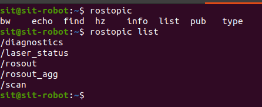
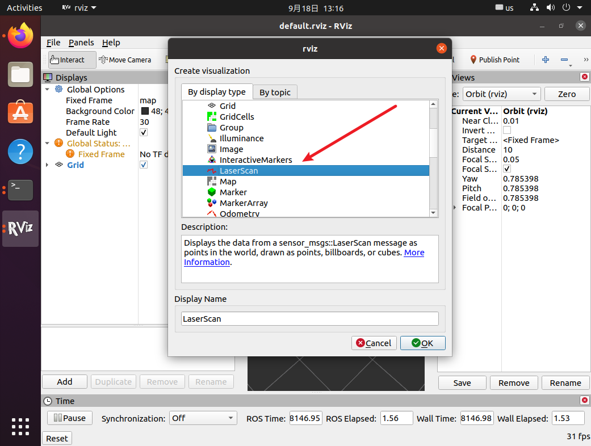
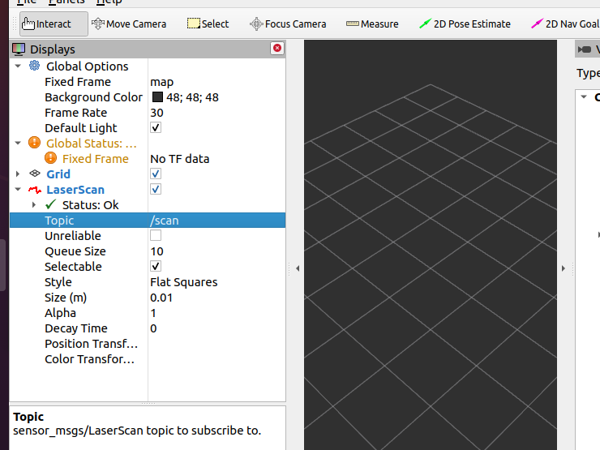

服务机器人上的激光雷达的ROS驱动程序可直接通过apt进行安装。

```bash
sudo apt install ros-noetic-urg-node
```

然后使用命令

```bash
rosrun urg_node urg_node
```

便可以启动激光雷达节点

通过`rostopic list`即可查看所有的话题列表中包含了激光雷达节点发布的话题/scan了



使用`rostopic echo /scan`即可查看/scan话题下发布的数据流。

也可在rviz的可视化工具中，添加LaserScan可视化组件




设置该可视化组件绑定的话题为/scan，然后便可在右侧三维空间中显示当前的激光雷达点云信息。(可能还需要设置全局坐标系为激光雷达的坐标系，默认为地图坐标系，但是地图此时还未加载)
