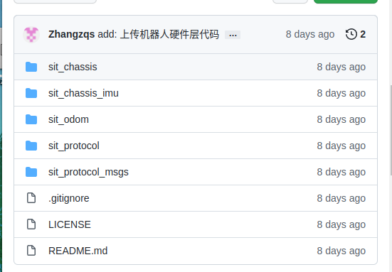
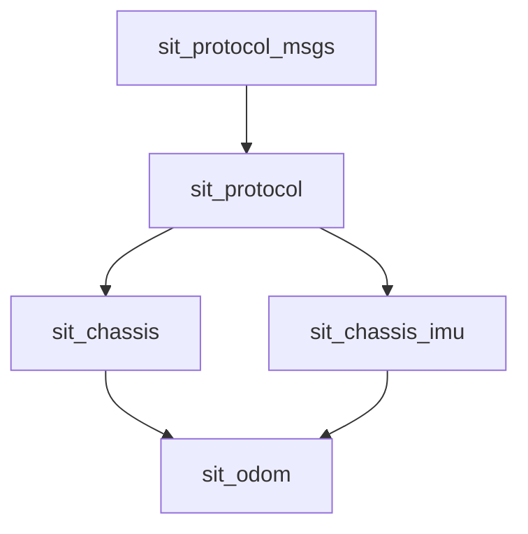

# 代码仓库



https://github.com/SIT-Robot/sit-robot-hardware

# 概要

我们在通过ros控制实体机器人时，免不了要跟真实的硬件打交道，这里的代码存放了与下位机通信的协议，对下位机的imu封装，对下位机底盘的运动学封装，对下位机里程计的封装。

这些功能包的依赖关系如下，



## sit_protocol_msgs

该功能包为一切与硬件通信的协议消息基石

规定机器人下位机与上位机之间任何消息传递均以数据帧为单位，对于任何ros层封装的硬件驱动，必须遵循此协议消息包进行封装。

### 消息定义

#### CmdDataFrame.msg

该消息规定了一帧消息协议

```bash
# 机器人的串口数据帧

# 地址域 8位的单字节地址(禁止是0号地址)
uint8 address

# 命令域 8位的单字节指令
uint8 cmd

# 数据域 可变长的字节数组
uint8[] data
```

每个设备自身都有对应的一个8位的地址，存于address字段。

如果一个address确定，那么目标通讯设备将确定。

下位机设备收到消息后，读取8位的cmd字段确定需要执行什么操作，通过解析data数组中的内容，执行相应的操作。

### 服务定义

#### RequestDataFrame.srv

```bash
# 发送请求数据帧
sit_protocol_msgs/CmdDataFrame request

# 等待响应的数据帧指令值
uint8 waitCmd

# 超时时间(单位ms) 默认值100ms
uint16 timeout = 100

---

# 接收响应数据帧
sit_protocol_msgs/CmdDataFrame response
```

上位机与下位机的通讯为同步的请求响应模型，上位机发送一个request数据帧，下位机收到后必须返回一个response数据帧，其中waitCmd为上位机期望的response中的cmd字段，若上位机在timeout时间内未收到response字段或response中的cmd与waitCmd不匹配，则视为请求超时，本次请求执行失败。

## sit_protocol

本功能包为与硬件通信的网关，所有的CmdDataFrame数据帧均传递到本功能包中

### 代码

<未完待续>
