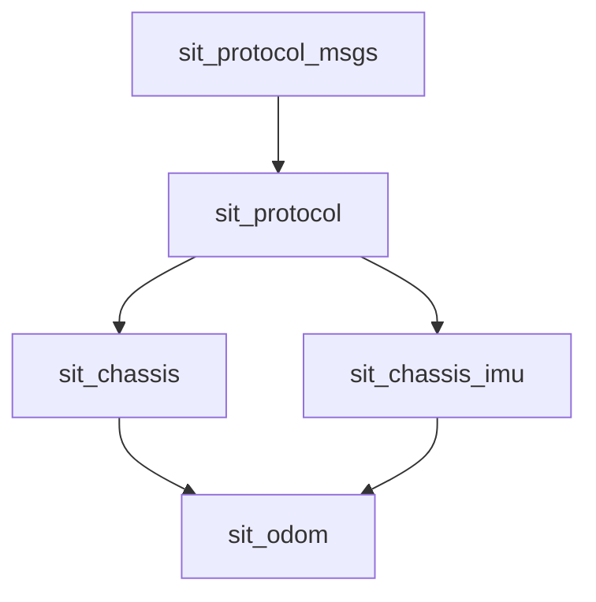

# 代码仓库


https://github.com/SIT-Robot/sit-robot-hardware

# 概要

我们在通过ros控制实体机器人时，免不了要跟真实的硬件打交道，这里的代码存放了与下位机通信的协议，对下位机的imu封装，对下位机底盘的运动学封装，对下位机里程计的封装。

这些功能包的依赖关系如下，



## sit_protocol_msgs

该功能包为一切与硬件通信的协议消息基石

规定机器人下位机与上位机之间任何消息传递均以数据帧为单位，对于任何ros层封装的硬件驱动，必须遵循此协议消息包进行封装。

### 消息定义

#### CmdDataFrame.msg

该消息规定了一帧消息协议

```bash
# 机器人的串口数据帧

# 地址域 8位的单字节地址(禁止是0号地址)
uint8 address

# 命令域 8位的单字节指令
uint8 cmd

# 数据域 可变长的字节数组
uint8[] data
```

每个设备自身都有对应的一个8位的地址，存于address字段。

如果一个address确定，那么目标通讯设备将确定。

下位机设备收到消息后，读取8位的cmd字段确定需要执行什么操作，通过解析data数组中的内容，执行相应的操作。

### 服务定义

#### RequestDataFrame.srv

```bash
# 发送请求数据帧
sit_protocol_msgs/CmdDataFrame request

# 等待响应的数据帧指令值
uint8 waitCmd

# 超时时间(单位ms) 默认值100ms
uint16 timeout = 100

---

# 接收响应数据帧
sit_protocol_msgs/CmdDataFrame response
```

上位机与下位机的通讯为同步的请求响应模型，上位机发送一个request数据帧，下位机收到后必须返回一个response数据帧，其中waitCmd为上位机期望的response中的cmd字段，若上位机在timeout时间内未收到response字段或response中的cmd与waitCmd不匹配，则视为请求超时，本次请求执行失败。

## sit_protocol

本功能包为与硬件通信的网关，所有的CmdDataFrame数据帧均传递到本功能包中

### 代码

#### CmdDataFrame结构体

[include/sit_protocol/CmdDataFrame.h](https://github.com/SIT-Robot/sit-robot-hardware/blob/master/sit_protocol/include/sit_protocol/CmdDataFrame.h)

该头文件定义了与ros解耦的数据帧定义

其成员函数generateBytes实现了该帧数据帧消息的二进制序列化操作，主要添加包头包尾，添加地址，命令，数据长度，数据域，校验和等字节信息。

toByteString，toString这俩函数主要是调试时输出数据帧信息的调试专用函数。

这里节选generateBytes函数实现，可以看出其实现还是比较简单的

```cpp
    std::vector<uint8_t> generateBytes(){
        std::vector<uint8_t> bytes;
        bytes.push_back(0x55);
        bytes.push_back(0xAA);
        bytes.push_back(address);
        bytes.push_back(cmd);
        bytes.push_back(data.size());
        for(uint8_t i : data){
            bytes.push_back(i);
        }

//        uint8_t sum = std::accumulate(bytes.begin()+2,bytes.end(),0);
        uint8_t sum = crc8(bytes.begin()+2,bytes.end());
        bytes.push_back(sum);
        bytes.push_back(0xBB);
        bytes.push_back(0xCC);
        return bytes;
    }
```

#### DataFrameParser类

[include/sit_protocol/DataFrameParser.h](https://github.com/SIT-Robot/sit-robot-hardware/blob/master/sit_protocol/include/sit_protocol/DataFrameParser.h)

该头文件定义了数据帧解析类，同样与ros解耦

可以想象该类为一台机器，向其中扔一个个字节，当能够组合出一组合法的二进制串为DataFrame时，你便可通过popFrame拿到其加工好的DataFrame

该类的职责便是反序列化出一个个DataFrame对象，它有两个public的成员函数。

+ pushByte(uint8_t byte)
  
  + 放入一个字节

+ pushBytes(uint8_t *byte, int len)
  
  + 放入一堆字节

+ CmdDataFrame popFrame()
  
  + 取出一个数据帧

+ bool empty()
  
  + 是否为空，如果不为空，则代表可以popFrame取出一个数据帧

#### SerialCommunicator类

[include/sit_protocol/SerialCommunicator.h](https://github.com/SIT-Robot/sit-robot-hardware/blob/master/sit_protocol/include/sit_protocol/SerialCommunicator.h)

该文件实现了基于串口面向字节流数据传输协议的通讯工具，其基于DataFrameParser类实现了在不可靠的串口通信下提供了基于帧数据传输，带有了错误校验的相对可靠的数据传输服务。

该类的构造函数需要传入一个Serial对象（本类依赖了serial串口通信库），然后其便提供了异步通信的如下函数

+ void sendFrame(CmdDataFrame& frame)
  
  + 发送一个数据帧

+ bool receivable()
  
  + 是否存在可接收的数据帧

+ CmdDataFrame receive()
  
  + 接收一帧数据

还提供了更方便的同步通信函数

+ bool requestFrame(CmdDataFrame req_frame, CmdDataFrame& resp_frame, uint16_t timeout = 40)
  
  + 该函数需传入请求数据帧信息，用于响应的接收数据帧（其需要接收数据，故使用引用传递），最大超时时间，同步请求必须设置超时时间，否则程序通信失败时本函数将卡死
  
  + 该函数返回值表示是否接收到响应帧信息，只有接收到响应，本次请求才视为成功请求。

#### ProtocolNode类

[include/sit_protocol/ProtocolNode.h](https://github.com/SIT-Robot/sit-robot-hardware/blob/master/sit_protocol/include/sit_protocol/ProtocolNode.h)

该类将SerialCommunicator类中的同步通信函数通过ros的服务通信机制封装了一层。

本类需要传入一个device_pool，这是一个map，其中key为uint8_t的整数，代表了设备地址，所有ros服务接收到的消息均通过其request数据帧中的地址查询device_pool分发到不同的设备。

#### utils.h

[include/sit_protocol/utils.h](https://github.com/SIT-Robot/sit-robot-hardware/blob/master/sit_protocol/include/sit_protocol/utils.h)

该头文件定义了一些常用工具，如crc8校验

#### 入口文件

[sit_protocol/src/sit_protocol_serial.cpp](https://github.com/SIT-Robot/sit-robot-hardware/blob/master/sit_protocol/src/sit_protocol_serial.cpp)
最后，该文件为主入口文件，main函数便定义在此，它完成了根据特定协议进行下位机自动发现，串口初始化，启动ProtocolNode类等操作。
